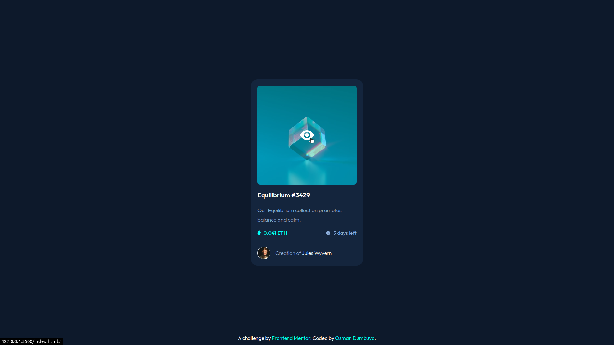

# Frontend Mentor - NFT-preview card component solution

This is my solution to the [NFT preview card component challenge on Frontend Mentor](https://www.frontendmentor.io/challenges/nft-preview-card-component-SbdUL_w0U). Frontend Mentor challenges help you improve your coding skills by building realistic projects. The challenges are definitely worth your time.

## Table of contents

- [Overview](#overview)
  - [The challenge](#the-challenge)
  - [Screenshot](#screenshot)
- [My process](#my-process)
  - [Built with](#built-with)
  - [What I learned](#what-i-learned)
  - [Continued development](#continued-development)
  - [Useful resources](#useful-resources)
- [Author](#author)

## Overview

### The challenge

Users should be able to:

- View the optimal layout depending on their device's screen size
- See hover states for interactive elements

### Screenshot

## My process

### Built with

- Semantic HTML5 markup
- CSS custom properties
- Flexbox
- Mobile-first workflow

### What I learned

One thing that stood out for me from this challenge is the icon overlay section, this was the most challenging part for me. This challenge covered all the basic things a new web developer should know and learn.

### Continued development

I specifically want to focus on strengthening my foundation of CSS. I find myself having to go back to remind myself of the basics. This is especially the case for knowing when to use em or rems and sizing properties such as width or max-width or min-width. I spent a lot of time with trial and error until it works. I will be going through a CSS course again to nail the basics.

### Useful resources

- [1](https://web.dev/learn/css/) - This was my go to for concise Box Model expplanation. I really liked how they provided simple and straighforward analogies. They also cover a lot more CSS topics.
- [2](https://www.w3schools.com/) - This is an amazing website which provided answers to so many questions I searched for on google. I'd recommend it to anyone still learning the basic concepts of web developement.

## Author

- Twitter - [@OsmanTolo\_](https://twitter.com/OsmanTolo_)
- Frontend Mentor - [@OsmanTolo](https://www.frontendmentor.io/profile/osmantolo)
